# Enhanced Message Processing System: Three-Phase Evolution

## Introduction

This document outlines the evolutionary journey of our message processing system through three distinct phases, culminating in a sophisticated architecture with priority-based consumer allocation. Each phase builds upon the previous one, addressing limitations and adding capabilities to create a comprehensive solution for distributed message processing.

## Phase 1: Basic Message Processing with RabbitMQ

The first phase establishes a foundation using RabbitMQ as the message broker, implementing basic publisher-consumer patterns without sophisticated state management or deduplication.

### High-Level Architecture

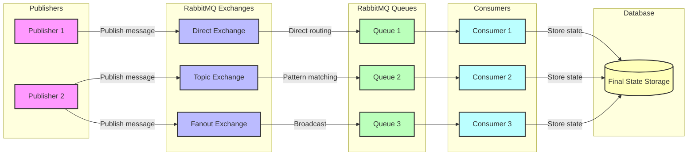

### Basic Message Processing Flow

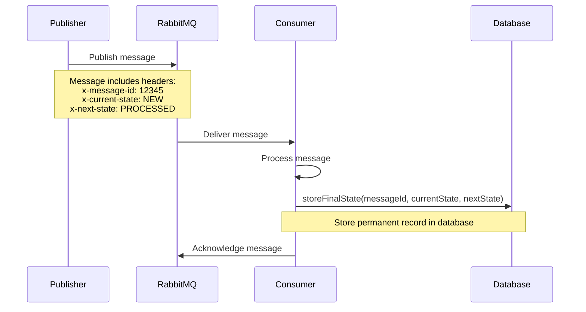

### Key Limitations

- No deduplication mechanism
- Fixed consumer allocation (one consumer per queue)
- Manual queue binding management
- No tracking of message processing state
- Risk of message duplication during failures or restarts

## Phase 2: Enhanced Reliability with Redis

The second phase introduces Redis for state management and implements comprehensive deduplication mechanisms while maintaining the basic consumer allocation model.

### Enhanced Architecture

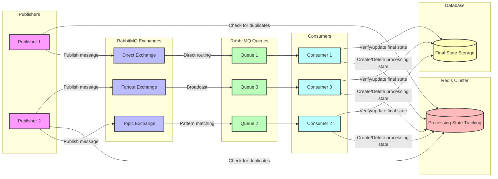

### Enhanced Processing Flow

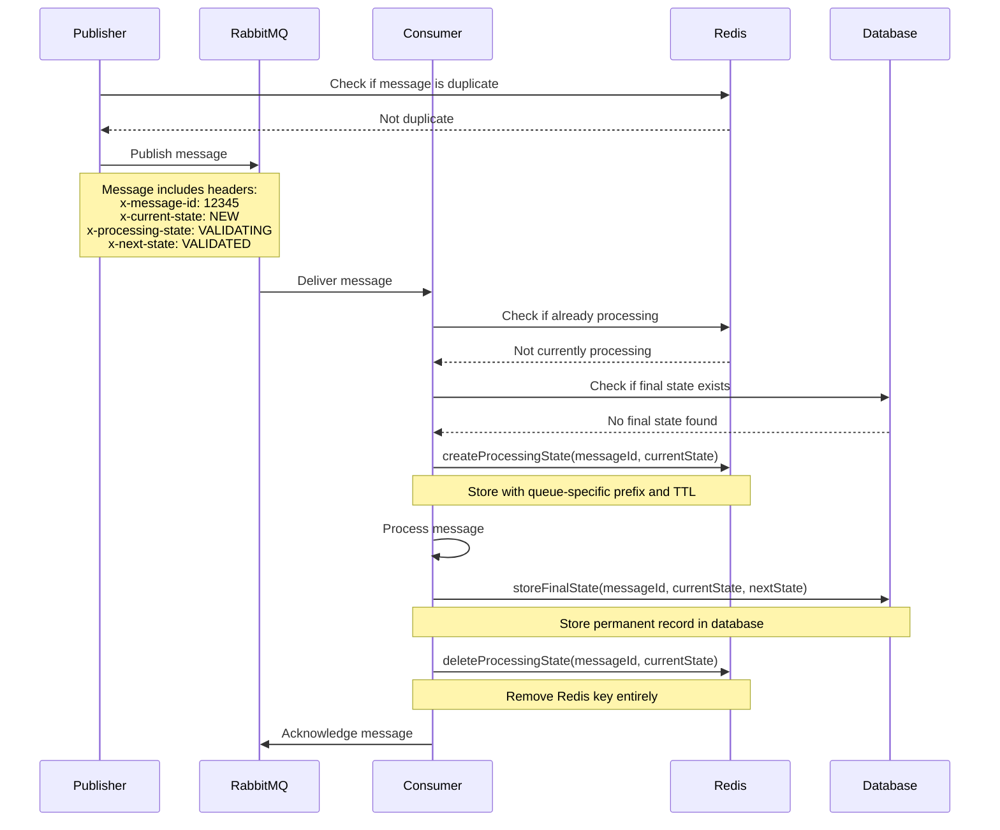

### Multi-Layer Verification for Deduplication

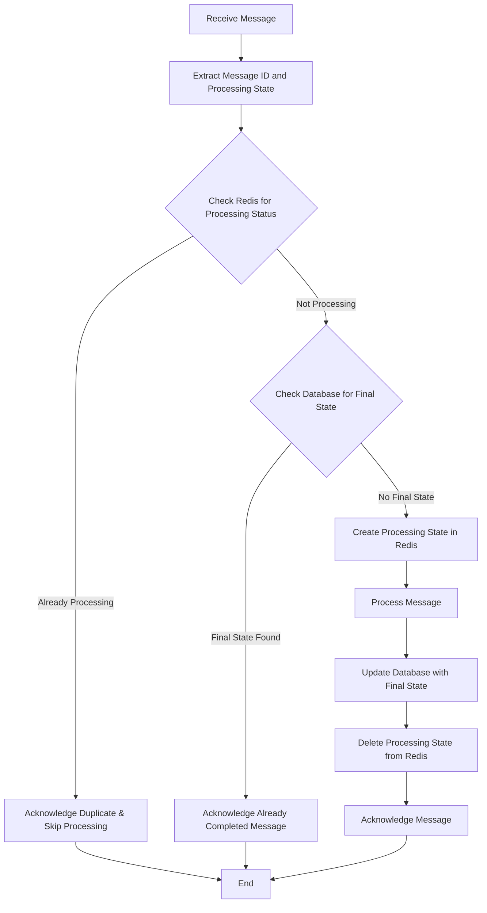

### Key Enhancements in Phase 2

- Multi-layer verification to prevent duplicate processing
- Efficient processing state management in Redis
- Local caching for improved performance
- Consumer-driven state management approach
- Improved resilience to failures and restarts

### Continuing Limitations

- Fixed consumer allocation (still one consumer per queue)
- Manual queue binding management
- Limited scalability for varying workloads
- No prioritization of message processing

## Phase 3: Ultimate Solution with Priority-Based Consumer Allocation

The final phase introduces etcd for coordination and implements priority-based consumer allocation, creating a comprehensive solution for sophisticated distributed message processing requirements.

## 1. Introduction

The Ultimate Message Processing System represents the culmination of our architectural evolution, building upon the foundations established in Phases 1 and 2. This comprehensive solution addresses the most sophisticated challenges in distributed message processing:

- Efficiently allocating processing resources based on queue priorities
- Supporting dynamic queue bindings and exchange configurations
- Ensuring proper state management throughout message processing
- Handling the lifecycle of processing state in temporary storage
- Maintaining clean separation of concerns across system components
- Automatically rebalancing consumers in response to system changes

The system uses RabbitMQ for message queuing, Redis for temporary state storage, and etcd for consumer coordination and configuration management. This architecture emphasizes consumer-driven state management, priority-based resource allocation, and centralized configuration, creating a robust and flexible platform for distributed message processing with state transitions.

## 2. Architecture Overview

### 2.1 High-Level Architecture

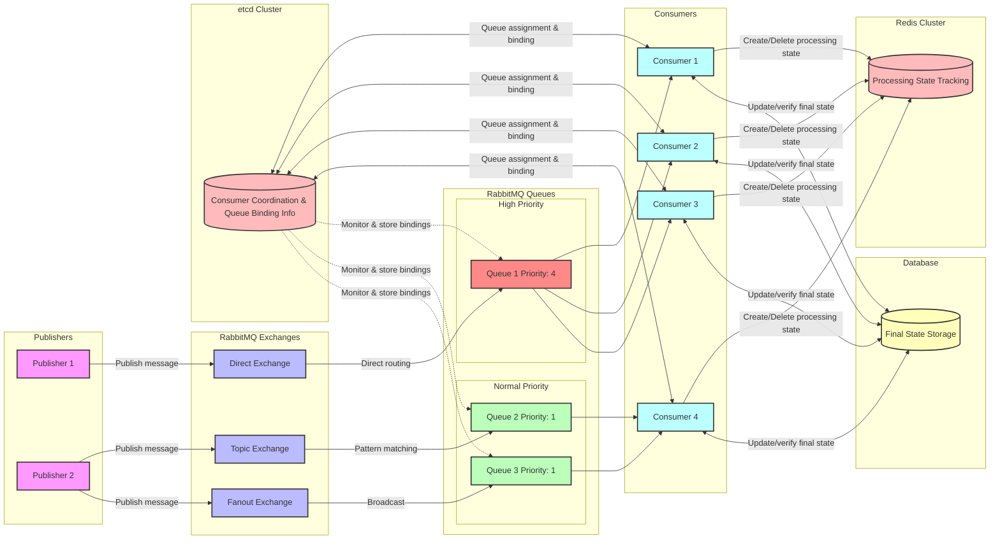

### 2.2 Component Relationships

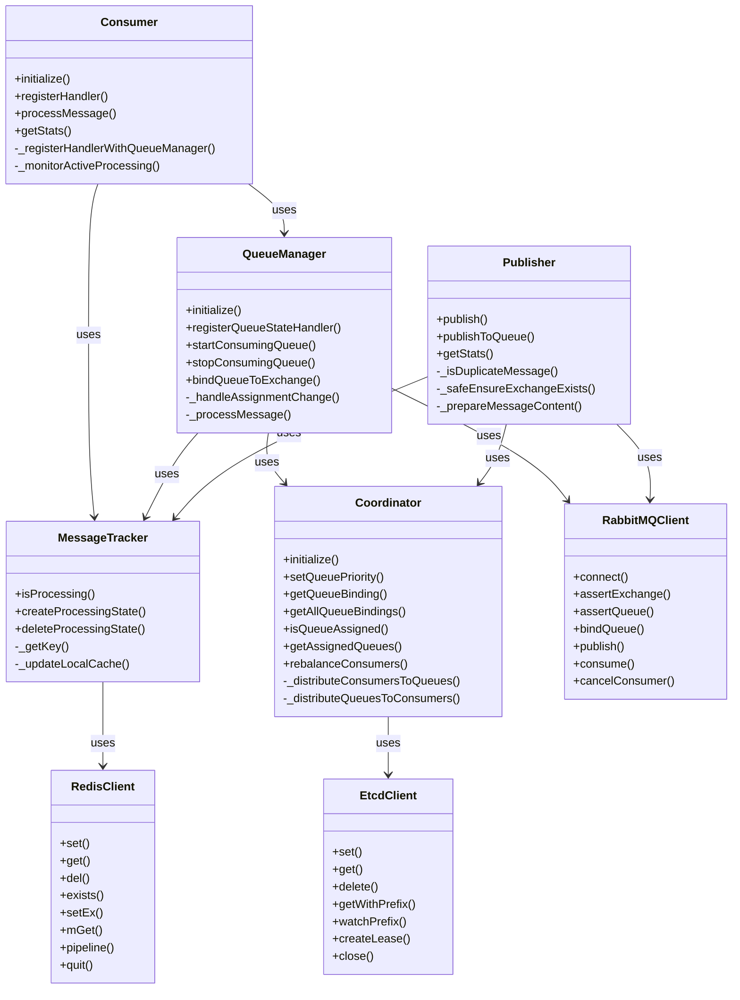

## 3. Priority-Based Consumer Allocation

A key feature of this system is the allocation of consumers to queues based on relative priorities. When a priority value is assigned to each queue, the system calculates and applies the optimal distribution of consumers.

### 3.1 Allocation Algorithm

The system implements a sophisticated algorithm for distributing consumers based on queue priorities:

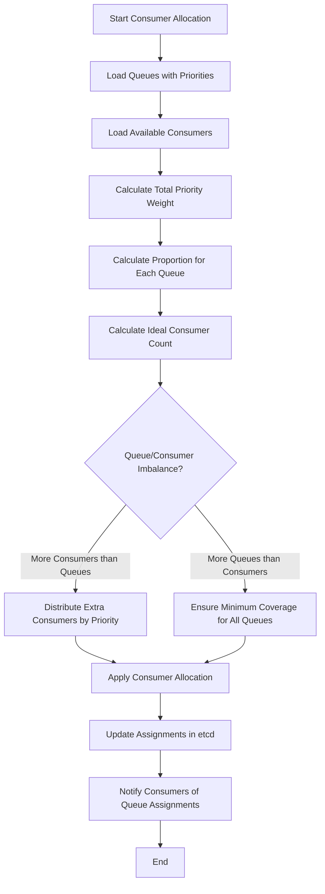

For example, if we have three queues with priorities 4, 1, and 1 (total priority weight of 6), and 6 available consumers:

- Queue 1 (priority 4): 4/6 = 66.7% → 4 consumers
- Queue 2 (priority 1): 1/6 = 16.7% → 1 consumer
- Queue 3 (priority 1): 1/6 = 16.7% → 1 consumer

This ensures that higher-priority queues receive proportionally more processing resources, reflecting their business importance.

### 3.2 Handling Queue-Consumer Imbalances

The system adapts intelligently to imbalances between queue and consumer counts:

#### More Consumers Than Queues

When there are more consumers than queues, the system distributes them proportionally based on queue priorities:

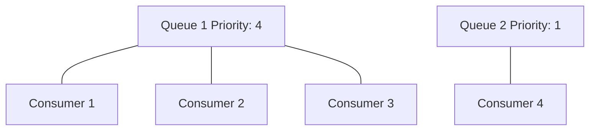

#### More Queues Than Consumers

When there are more queues than consumers, the system ensures high-priority queues receive adequate attention while still providing processing for lower-priority queues:

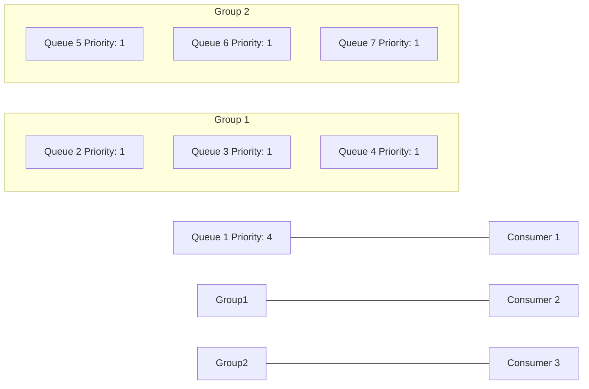

## 4. Queue Binding Management

A significant enhancement in this system is the centralized management of queue bindings. The Coordinator stores binding information alongside priority data, providing a single source of truth for queue-exchange relationships.

### 4.1 Binding Registration Process

The system implements a comprehensive process for registering and managing queue bindings:

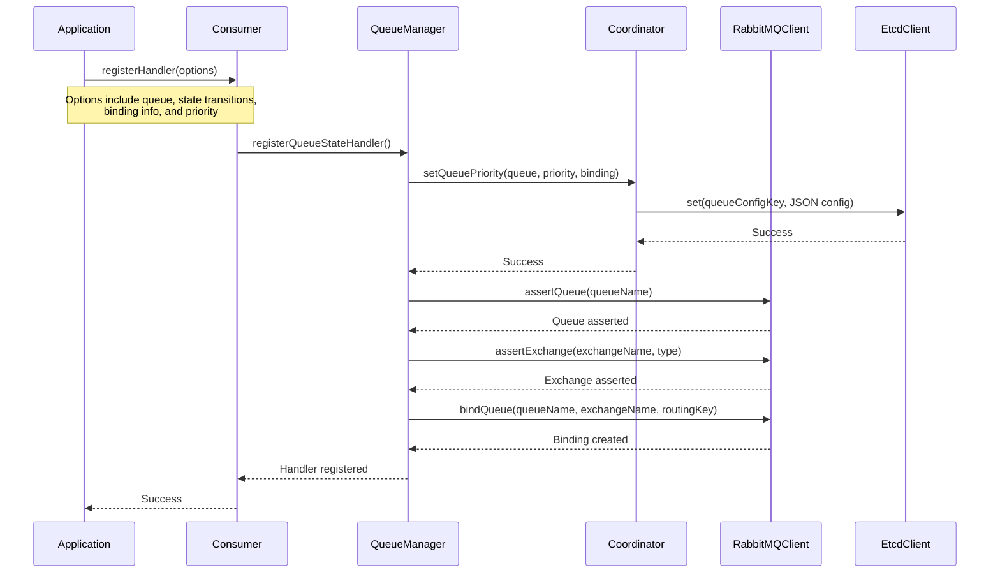

### 4.2 Queue Binding Information Storage

The binding information is stored in etcd with the following structure:

```json
{
  "priority": 3,
  "updatedAt": 1647354982123,
  "binding": {
    "exchangeName": "orders",
    "routingKey": "orders.new",
    "exchangeType": "direct"
  }
}
```

This approach ensures that:

1. All components have access to binding information
2. Queue bindings are recreated correctly if a component restarts
3. Binding configuration is consistent across the system
4. Priority information is maintained alongside binding data

## 5. Consumer-Driven Processing State in Redis

A key aspect of this system is that consumers, not publishers, manage processing state in Redis. This creates a more accurate reflection of actual processing status.

### 5.1 Processing State Lifecycle

The system implements a clean and efficient lifecycle for processing state:

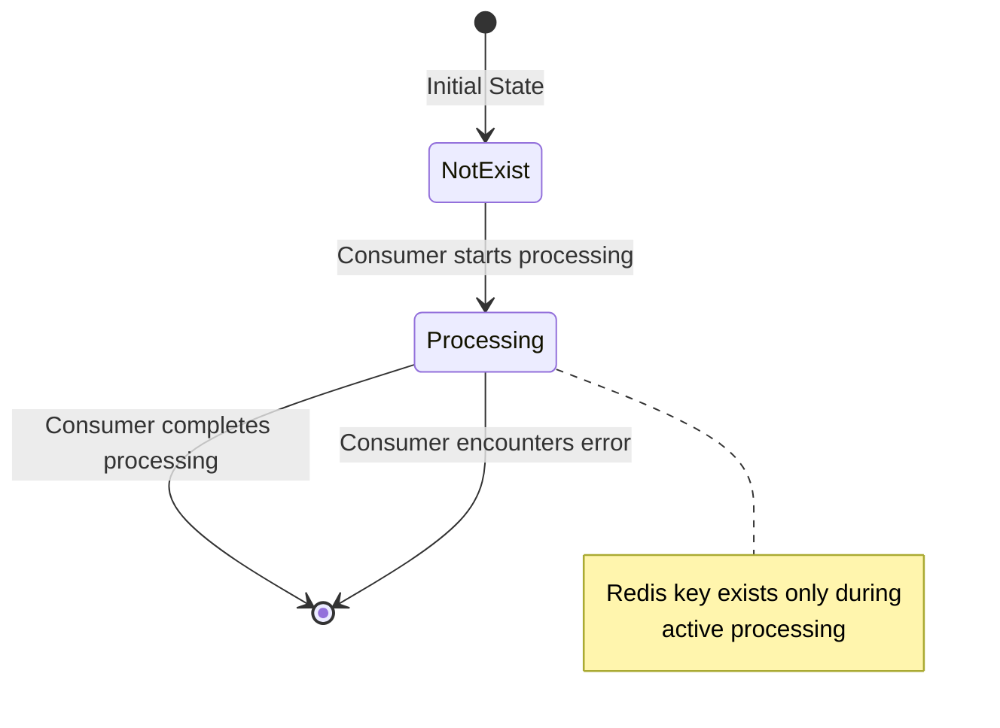

Rather than updating Redis records to indicate completion or failure, consumers simply remove the key once processing is finished. This keeps the Redis store lean and focused only on actively processing messages.

### 5.2 Message Processing Flow

The system follows a sophisticated message processing flow that integrates all components:

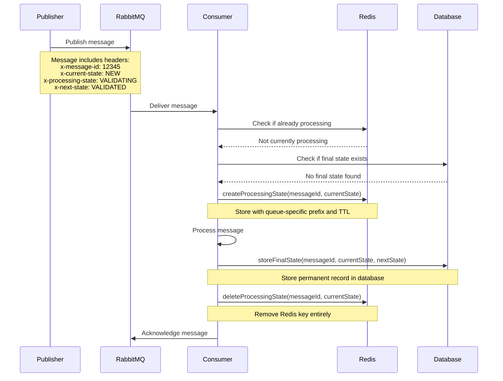

This approach ensures that:

1. Messages already being processed are not duplicated
2. Messages that completed processing are not reprocessed
3. Redis remains clean and focused only on currently processing messages

## 6. Implementation Details

### 6.1 Core Components

The system has five main components, each with specific responsibilities:

1. **Coordinator** - Manages consumer distribution and stores queue bindings
2. **QueueManager** - Handles RabbitMQ queue operations and coordinates consumer assignment
3. **Consumer** - Processes messages and manages processing state
4. **Publisher** - Publishes messages with appropriate state information
5. **MessageTracker** - Manages temporary processing state in Redis

Each component is designed with clear responsibilities and interfaces, promoting loose coupling and high cohesion across the system.

### 6.2 Main Changes to the Implementation

#### Coordinator Updates

- Added support for storing queue binding information with priorities
- Created methods for retrieving binding information
- Enhanced distribution algorithm for better consumer allocation
- Implemented dynamic rebalancing capabilities
- Added support for watching etcd for configuration changes

#### QueueManager Updates

- Modified to use binding information from Coordinator
- Enhanced queue-consumer assignment handling
- Improved error handling for queue operations
- Added dynamic queue unbinding and rebinding capabilities
- Implemented graceful consumer reassignment

#### Consumer Updates

- Enhanced handler registration to include binding information
- Streamlined message processing workflow
- Improved error handling and state cleanup
- Added support for handling multiple queue assignments
- Implemented priority-aware processing strategies

#### Publisher Updates

- Added support for accessing binding information
- Enhanced priority management in message publishing
- Improved connection error handling and retries
- Implemented safe exchange creation and verification
- Enhanced message preparation with consistent headers

### 6.3 Application Integration

The application code (main.js and publish.js) now handles:

1. Setting up the infrastructure (exchanges and queues)
2. Creating bindings with proper priorities
3. Registering handlers with complete information
4. Publishing messages with appropriate routing
5. Configuring component interactions and dependencies

This improves separation of concerns and makes the system more maintainable while providing a clean API for application developers.

## 7. Multi-Layer Verification for Deduplication

The system implements a comprehensive approach to prevent duplicate processing, building on the foundations established in Phase 2 but enhancing them with additional optimizations:


This verification approach ensures that:

1. Messages already being processed by another consumer are not processed twice
2. Messages that have already reached their final state are not reprocessed
3. Only messages that genuinely need processing are handled
4. Redis remains clean and focused only on currently processing messages
5. System remains resilient to consumer failures and restarts
6. Message processing is idempotent across the distributed system

## 8. Benefits and Considerations

### Benefits

1. Optimized Resource Allocation
   - Higher priority queues receive proportionally more processing resources
   - System adapts to imbalances between queue and consumer counts
   - Dynamic rebalancing ensures optimal resource utilization
   - Priority-based allocation reflects business importance of different message types
2. Centralized Binding Management
   - Single source of truth for queue-exchange relationships
   - Consistent binding configuration across the system
   - Simplified consumer registration with complete binding information
   - Automatic recreation of bindings after system restarts
3. Efficient State Management
   - Redis contains only active processing records
   - Clean lifecycle for processing state
   - Reduced Redis storage requirements
   - Optimized TTL-based cleanup of state information
4. Improved Error Handling
   - Comprehensive error handling at each step
   - Proper cleanup of processing state on errors
   - Clear distinction between temporary and permanent state
   - Graceful recovery from component failures
5. Clear Separation of Concerns
   - Publishers focus solely on publishing
   - Consumers handle state management
   - Coordinator manages resource allocation
   - QueueManager handles RabbitMQ operations
   - Application code manages infrastructure setup
6. Enhanced Scalability
   - Easy addition or removal of consumers
   - Automatic rebalancing when resources change
   - Support for variable workloads across queues
   - Graceful degradation under high load

### Considerations

1. Dependency on External Systems
   - Relies on RabbitMQ, Redis, and etcd for operation
   - Requires proper configuration and monitoring of these systems
   - Need for high availability configurations for all dependencies
   - Potential for cascading failures if not properly managed
2. Complexity
   - More complex than a simple message broker system
   - Requires understanding of distribution algorithms and state management
   - Steeper learning curve for developers
   - More sophisticated operational requirements
3. Performance
   - Multiple systems introduce latency
   - Requires careful tuning for high-throughput scenarios
   - Additional network traffic for coordination
   - Potential bottlenecks in etcd during rapid rebalancing events
4. Operational Overhead
   - More components to monitor and maintain
   - Need for comprehensive observability solutions
   - Requires expertise in multiple distributed systems
   - More complex deployment and upgrade processes

## 9. Conclusion

The Enhanced Message Processing System with priority-based consumer allocation represents a comprehensive solution for sophisticated distributed processing requirements. This ultimate architecture builds upon the foundations established in previous phases, adding significant enhancements for resource allocation, configuration management, and system coordination.

The key strengths of this ultimate solution are:

1. **Priority-based allocation of processing resources**
   - Proportional distribution based on business importance
   - Intelligent handling of resource imbalances
   - Dynamic rebalancing as conditions change
   - Optimal utilization of available consumers
2. **Centralized management of queue bindings**
   - Single source of truth in etcd
   - Consistent configuration across components
   - Runtime discovery of binding information
   - Resilience to component restarts
3. **Efficient consumer-driven state management**
   - Clean state lifecycle in Redis
   - Focused storage of only active processing states
   - TTL-based protection against orphaned records
   - Optimized use of temporary storage
4. **Comprehensive deduplication and error handling**
   - Multi-layer verification to prevent duplicates
   - Graceful handling of failures at all stages
   - Clear distinction between processing states
   - Proper cleanup and acknowledgment patterns
5. **Sophisticated coordination with etcd**
   - Real-time queue assignment updates
   - Consumer monitoring and health tracking
   - Configuration distribution and consistency
   - Lease-based consumer registration

The architecture creates a flexible, reliable framework that can handle diverse workloads with varying priorities and processing requirements. By centralizing binding configuration and implementing a clean approach to processing state, the system is more maintainable and scalable than traditional approaches.

The clear separation of responsibilities between system components enhances maintainability, while the priority-based allocation ensures that processing resources are distributed according to business importance. This ultimate solution provides a robust platform for building sophisticated message-processing applications with complex state management requirements.

### Evolution Summary

The three-phase evolution of our message processing system demonstrates a thoughtful progression from a simple publisher-consumer model to a sophisticated architecture with priority-based allocation:

1. **Phase 1**: Established the foundation with basic RabbitMQ integration
2. **Phase 2**: Added Redis for state management and deduplication
3. **Phase 3**: Introduced etcd for coordination and priority-based allocation

Each phase addressed the limitations of the previous one while maintaining compatibility and building upon existing functionality. This incremental approach allows for staged implementation and validation, reducing risk while progressively enhancing system capabilities.
